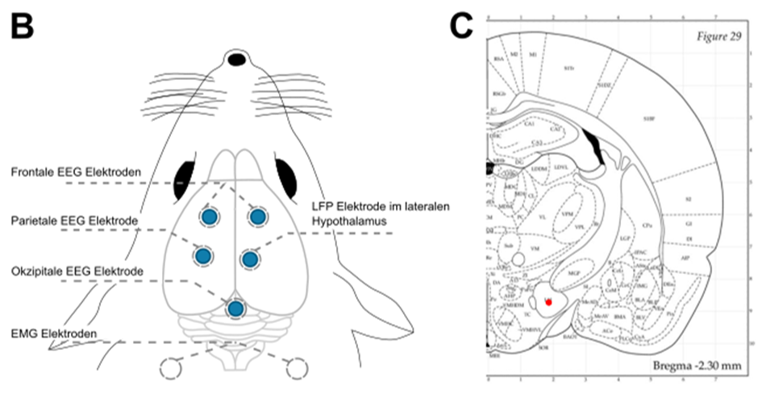
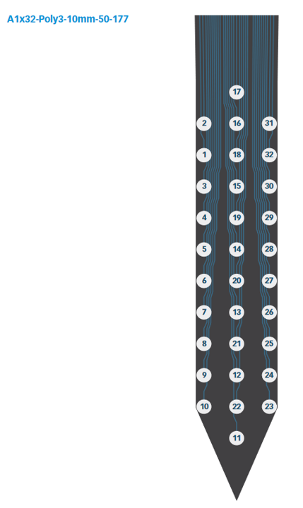

# Recording parameters
Ephys recordings are done on a DigitalLynxSX with sample frequency of 32000 Hz. 

Raw data is sampled with a broad bandpass filter of 0.1 - 5000 Hz 

# Electrodes
Animals are imlanted in the following scheme: 

## EEG
Screw electrodes from Bilaney (0-80 Screw, E363/20/2.4/SPC) are used for frontal and parietal EEGs. 

## EMG
Stainless steel electrodes from Bilaney (E363/3/Spc) are used for EMG from the neck muscels. 

## Silicon probe 

Animals HYDO 01-03 were implented with B-probes from Neuronexus of the type:

|  Animal |  Probe ID |  Defective Channels | DV Coordinate |
|---|---|---|---|
| HYDO01  |  #11EEG | 2, 3  |  -8.8 mm | 
| HYDO02 |  #11EF3 |  11, 12 |  -8.5  mm | 
| HYDO03  |  #Q853 |  29, 30 |     | 

## Ground 

## Reference 

